<div align="center">

# 🛡️ FarmShield (फार्मशील्ड)
### *National Digital Livestock Surveillance, Disease Intelligence & MRL Compliance Decision Support Platform*

[](https://farm-shield-psi.vercel.app/)
[-02569B?style=for-the-badge&logo=android&logoColor=white)](https://github.com/kartikwritescode/FarmShield/releases/download/v1/FarmShield.apk)
[](LICENSE)

<br/>

[](https://flutter.dev)
[](https://dart.dev)
[](https://nextjs.org/)
[](https://react.dev/)
[](https://www.typescriptlang.org/)
[](https://fastapi.tiangolo.com/)
[](https://supabase.com)
[](https://docs.hivedb.dev/)
[](https://render.com)
[](https://vercel.com)

<p align="center">
  <b>Bridging the Gap Between Grassroots Livestock Care and National Animal Health Governance</b><br>
  Built for Livestock Farmers, Field Veterinarians, Para-Veterinary Cadres, and Animal Husbandry Departments.
</p>

[🌐 Live Web Portal](https://farm-shield-psi.vercel.app/) • [📱 Download Android APK](https://github.com/kartikwritescode/FarmShield/releases/download/v1/FarmShield.apk) • [📖 Deployment Guide](DEPLOYMENT.md) • [📡 Backend API Docs](web/BACKEND_ARCHITECTURE_AND_API_DOCUMENTATION.md) • [🧠 ML Microservice Docs](web/FASTAPI_ML_API_DOCUMENTATION.md)

---

</div>

## 📌 Executive Summary

**FarmShield** is an enterprise-grade digital livestock health intelligence, epidemiological surveillance, and food safety compliance ecosystem. It tackles three urgent national challenges in the livestock and dairy sectors:

1. **Antimicrobial Resistance (AMR) & MRL Non-Compliance:** Unmonitored antibiotic administration in dairy and livestock causes drug residues exceeding Maximum Residue Limits (MRL) in the human food supply chain. FarmShield enforces strict withdrawal periods through dynamic real-time countdown engines.
2. **Delayed Epidemiological Outbreak Detection:** Remote rural livestock clusters lack instant disease reporting mechanisms, leading to preventable transmission of high-mortality epizootics such as Foot-and-Mouth Disease (FMD), Lumpy Skin Disease (LSD), and Hemorrhagic Septicemia (HS).
3. **Connectivity Blindspots in Field Operations:** Rural farmlands frequently suffer from poor or non-existent cellular coverage. FarmShield's offline-first architecture with persistent mutation queuing guarantees uninterrupted field data capture and deterministic two-way cloud reconciliation.

---

## ⚡ Quick Access Links

| Resource | Target Platform | Link | Status |
| :--- | :--- | :--- | :---: |
| **🌐 Production Web Portal** | Next.js 16 (Responsive Web) | [farm-shield-psi.vercel.app](https://farm-shield-psi.vercel.app/) |  |
| **📱 Mobile App Release** | Android 8.0+ (Universal APK) | [Download FarmShield.apk (v1.0)](https://github.com/kartikwritescode/FarmShield/releases/download/v1/FarmShield.apk) |  |
| **⚙️ Backend API Service** | Node.js / Express (Render) | `https://farmshield-buvy.onrender.com` |  |
| **📄 System License** | Open Source | [MIT License](LICENSE) |  |

---

## 📸 Application Showcase

FarmShield provides an intuitive, high-performance user experience tailored for both high-paced mobile field use and comprehensive desktop administration.

### 📱 Mobile Field Experience (Flutter)

<div align="center">

| Command Center & Animal Registry | Clinical Passport & Treatments |
| :---: | :---: |
| 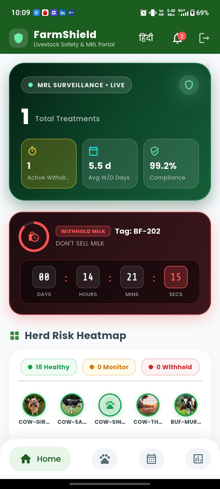 <br/> <sub><b>Dashboard</b>: Health KPIs, Quick Actions, Risk Banner</sub> | 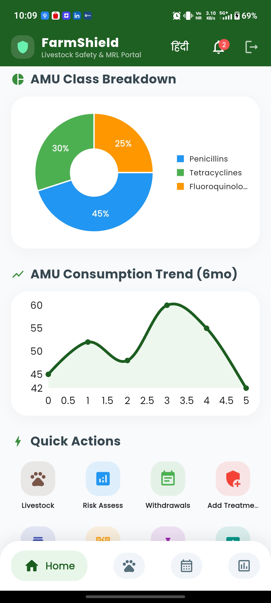 <br/> <sub><b>Animal Profile</b>: Identification, Breed, Physical Attributes</sub> |
| 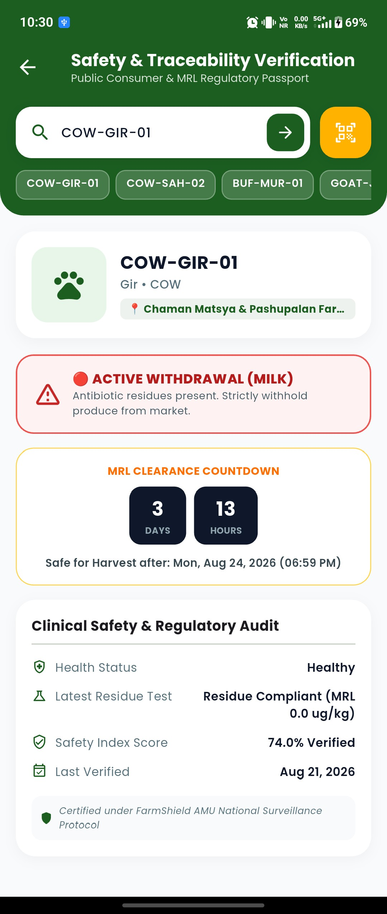 <br/> <sub><b>Digital Passport</b>: QR Verification, Vaccination Records</sub> | 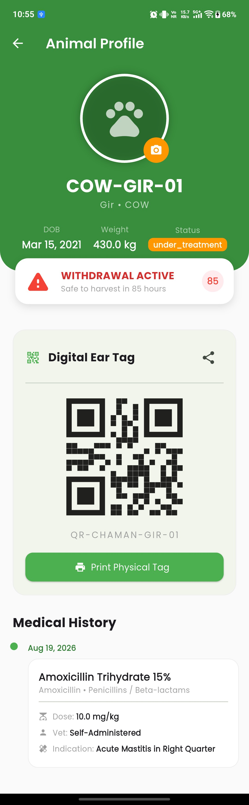 <br/> <sub><b>Treatment Record</b>: Diagnosis, Dosage, Drug Class</sub> |

<br/>

| AMU & MRL Withholding Governance | Geospatial Epidemic Surveillance |
| :---: | :---: |
| 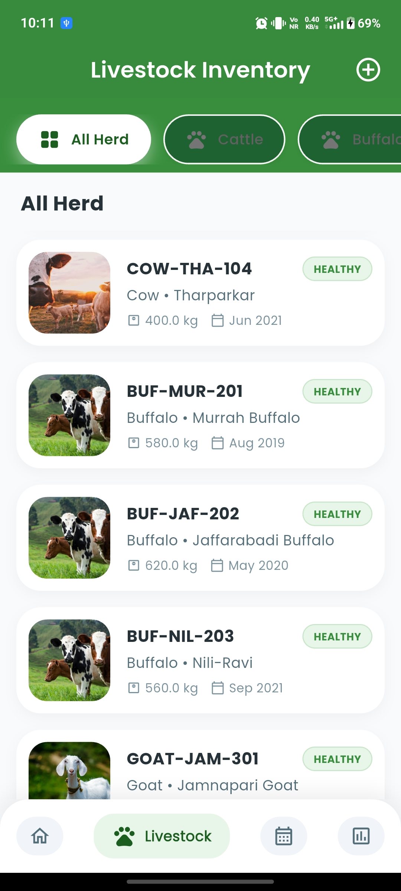 <br/> <sub><b>MRL Countdown</b>: Live Milk & Meat Withholding Timers</sub> | 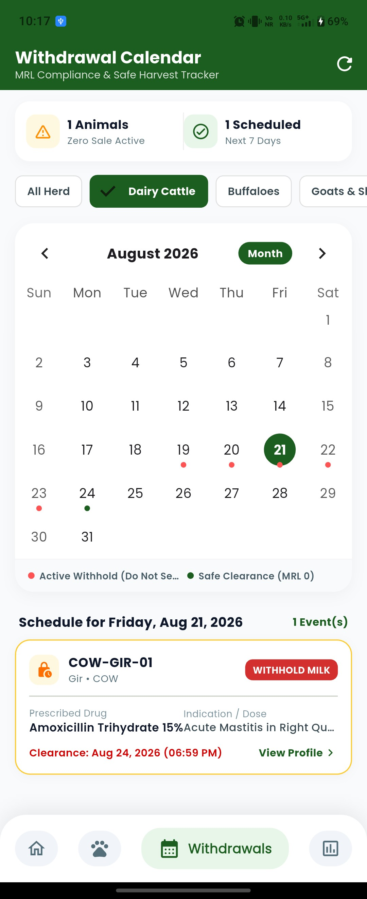 <br/> <sub><b>Epidemic Map</b>: Heat Halos, Cluster Bounds & Pathogen Layers</sub> |
| 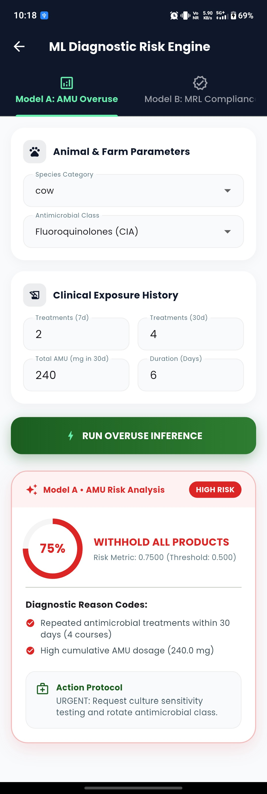 <br/> <sub><b>Syndromic Triage</b>: Rectal Temp Slider, Symptom Chips</sub> | 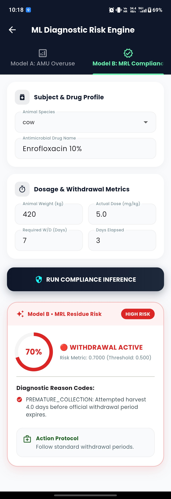 <br/> <sub><b>PDF Export</b>: Tamper-proof Medical Certificates & Prescriptions</sub> |

<br/>

| Drug Catalog & AI Hazard Intelligence | Offline Synchronization & Operations |
| :---: | :---: |
| 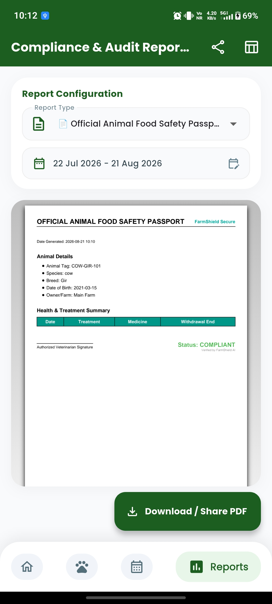 <br/> <sub><b>Formulary</b>: CIA Class, Standard Dosages, Withdrawal Days</sub> | 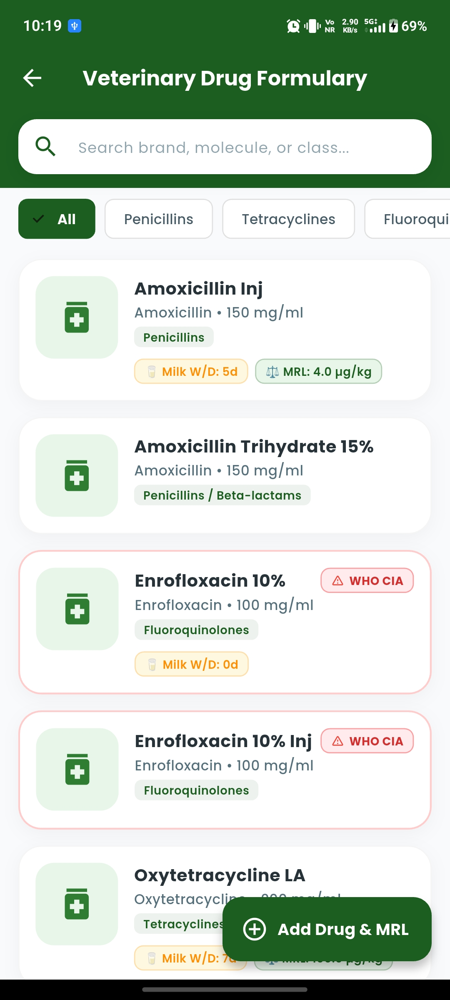 <br/> <sub><b>Predictive Models</b>: THI Heat Stress & Disease Proliferation</sub> |
| 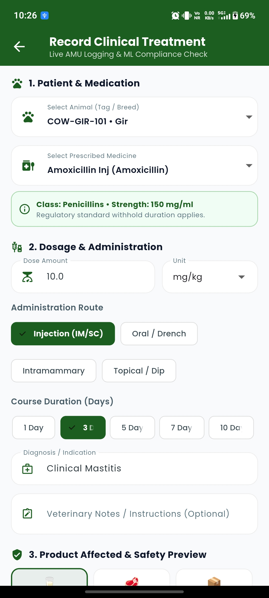 <br/> <sub><b>Compliance Engine</b>: Safe Consumption Status & Audit History</sub> | 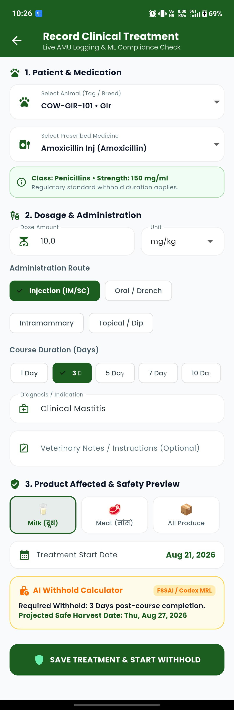 <br/> <sub><b>Alerts</b>: Real-time Quarantines & Outbreak Warnings</sub> |

<br/>

| Herd Inventory & System Configuration | Tele-Health & Clinical Oversight |
| :---: | :---: |
| 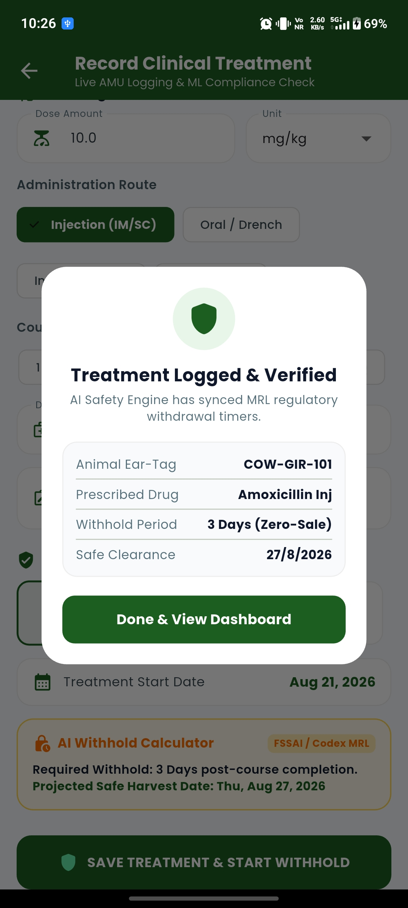 <br/> <sub><b>Herd Inventory</b>: Health State Ratios, Species Filtering</sub> | 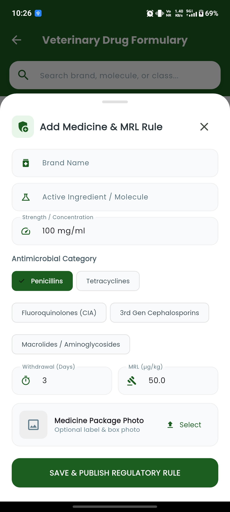 <br/> <sub><b>Sync Diagnostics</b>: Persistent Mutation Queue & Retry Engine</sub> |
| 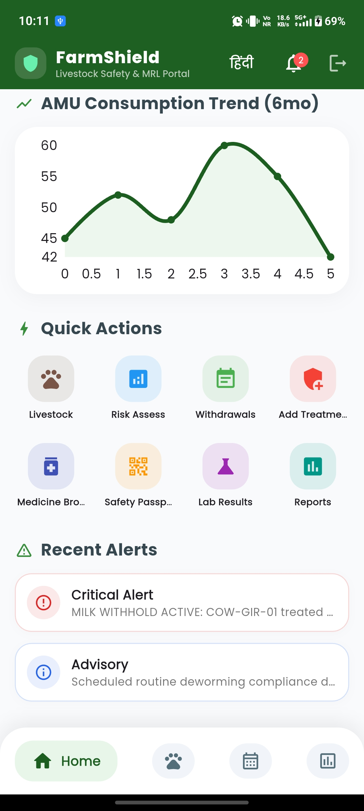 <br/> <sub><b>Accessibility</b>: Multilingual Localized Vernacular Interface</sub> | 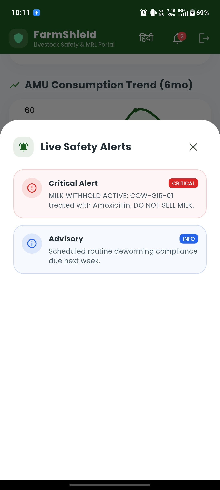 <br/> <sub><b>Veterinary Oversight</b>: Case Reviews, Validation, Lab Integration</sub> |

</div>

---

## 🏗️ Architectural Overview

FarmShield employs a distributed, offline-first client-edge-cloud architecture engineered for resilient field operation, instant optical identification, and high-throughput epidemiological surveillance.

### 📐 Detailed Architecture Diagram

<div align="center">
  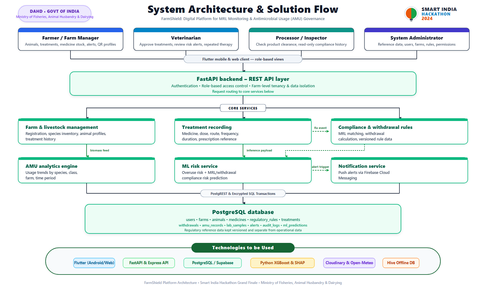
</div>

<br/>

### 🔄 End-to-End System Flowchart

<div align="center">
  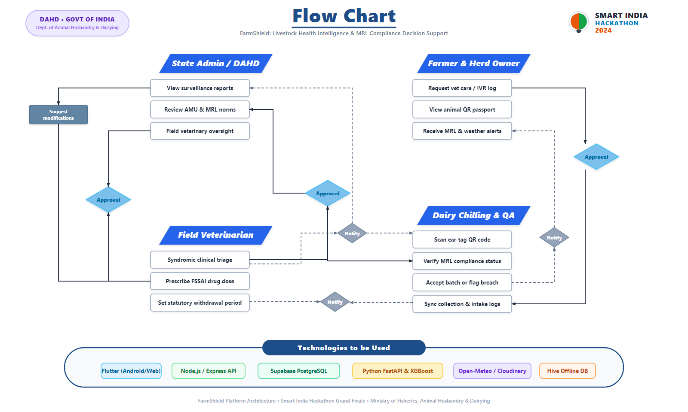
</div>

<br/>

### 💻 System Topology (Mermaid)

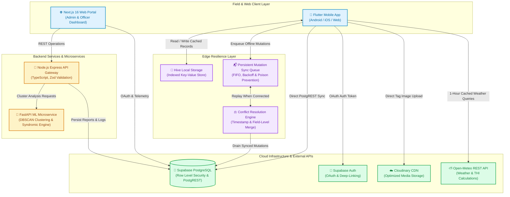

---

## 🌟 Core Feature Modules

### 1. 📶 Offline-First Synchronization Engine
- **Zero Data Loss in Rural Fieldwork**: Works entirely without internet connection. Farmers and veterinarians can register animals, record clinical signs, log treatments, and perform triage completely offline.
- **Persistent FIFO Mutation Queue**: Every offline mutation (animal creation, treatment log, syndrome report) is serialized to an encrypted local Hive box with strict FIFO processing.
- **Exponential Backoff with Jitter**: Protects against connection storms when transitioning between dead zones and cellular networks.
- **Poison-Pill Prevention**: Automatically quarantines exhausted mutations after max retry limits, preventing queue deadlock.
- **Bi-Directional Conflict Resolution**: Handles concurrent edits using deterministic server-wins / last-write-wins policies with field-level merging.

### 2. 🔍 Optical QR Animal Identification & Media Pipeline
- **Instant Optical Tag Scanning**: Native camera scanner extracts ear-tag tokens from physical QR tags, deep links (`https://farmshield.in/qr/COW-101`), raw tokens, and UUIDs with fallback manual search.
- **Cloudinary Media Ingestion**: Direct cloud upload with automatic format validation, size capping (10MB), and public ID tracking.
- **Digital Animal Passport**: Produces verifiable animal health passports detailing breed, age, species, vaccination history, and active withdrawal states.
- **Verifiable PDF Certificates**: Generates tamper-proof veterinary health and fit-for-transit certificates for regulatory inspections.

### 3. 🧠 Clinical Decision Support & Explainable Triage
- **100% Deterministic Rule-Based Triage**: Zero opaque AI hallucinations. Evaluates complex multisystem clinical signs against established veterinary epidemiological protocols:
  - **Foot-and-Mouth Disease (FMD)**: Detects oral vesicles, hyper-salivation, and coronary hoof lesions &rarr; Immediate Biosecurity Protocol.
  - **Lumpy Skin Disease (LSD)**: Recognizes cutaneous nodular lesions and limb edema &rarr; Vector Isolation & Ring Vaccination Alert.
  - **Hemorrhagic Septicemia (HS)**: Submandibular throat edema and acute respiratory distress &rarr; Critical Immediate Intervention.
  - **Anthrax**: Sudden unexpected mortality, uncoagulated natural orifice hemorrhage &rarr; **DO NOT OPEN CARCASS** Biosecurity Protocol.
  - **Clinical Mastitis**: Hard swollen quarters, flocculent milk &rarr; Strict milk withholding enforcement.
  - **Bovine Babesiosis (Tick Fever)**: High fever and hemoglobinuria &rarr; Vector acaricide containment.
- **Interactive Triage Sheet**: Live symptom selection chips, rectal temperature slider, immediate urgency badges, and recommended quarantine days.

### 4. 💊 Maximum Residue Limit (MRL) & AMU Governance
- **Antimicrobial Usage (AMU) Tracking**: Logs every antibiotic administration against WHO/WOAH Critically Important Antimicrobials (CIA) classifications.
- **Live Withholding Countdown Engine**: Automatically calculates exact milk and meat withholding completion timestamps based on drug pharmacokinetics and dosage rules.
- **Visual Compliance Badges**: Displays reactive green (`SAFE`), yellow (`CAUTION`), or red (`RESTRICTED`) badges on animal profiles and dairy collection checklists.

### 5. ⛅ Biometeorological Hazard & Heat Stress Index (THI)
- **Keyless Zero-Cost Ingestion**: Seamless integration with the Open-Meteo REST API with 1-hour local coordinate caching.
- **Temperature-Humidity Index (THI) Calculation**:
  $$\text{THI} = (1.8 \times T + 32) - (0.55 - 0.0055 \times RH) \times (1.8 \times T - 26)$$
- **Livestock Stress Classification**:
  - `THI < 72`: Normal (Optimal Comfort)
  - `72 <= THI < 79`: Alert (Mild Heat Stress, Monitor Water Intake)
  - `79 <= THI < 89`: Danger (Moderate Heat Stress, Yield Drop)
  - `THI >= 89`: Emergency (Severe Heat Stress, Emergency Cooling Required)
- **Vector Proliferation Multiplier**: Predicts surge conditions for *Culicoides* midges, *Stomoxys* biting flies, and *Rhipicephalus* ticks linked to vector-borne disease outbreaks.

### 6. 🗺️ Geospatial Outbreak Intelligence & Spatial Clustering
- **Interactive Map Visualizer**: Google Maps engine with customizable overlays:
  - **Risk Heatmap Halos**: Color-coded radial halos indicating outbreak intensity.
  - **Pathogen Filtering**: Granular isolation of specific diseases (FMD, LSD, HS, Mastitis, Anthrax).
  - **Incident Markers**: Rich bottom sheets displaying case history, affected counts, and quarantine statuses.
- **DBSCAN Spatio-Temporal Discovery**: The Python ML microservice executes Density-Based Spatial Clustering of Applications with Noise (DBSCAN) to discover emergent outbreak epicenters before widespread propagation.

---

## 📁 Repository Structure

```text
FarmShield/
├── app/                                 # Flutter Cross-Platform Mobile Client
│   ├── android/                         # Android Native Config, Manifest & Secrets
│   ├── ios/                             # iOS Native Runner & Assets
│   ├── lib/
│   │   ├── main.dart                    # Application Bootstrap & Route Startup Gate
│   │   └── app/
│   │       ├── core/
│   │       │   ├── services/            # Weather, Cloudinary, Hive, FCM Alert Service
│   │       │   ├── theme/               # FarmShield Design System (Colors, Typography)
│   │       │   └── widgets/             # Reusable UI Tokens, Status Indicators
│   │       ├── data/
│   │       │   ├── models/              # Data Models (Animal, Treatment, Risk, Geo, MRL)
│   │       │   ├── repositories/        # FarmRepository (Supabase & Offline Sync)
│   │       │   ├── services/            # LocalDatabaseService, NetworkConnectivityService
│   │       │   └── sync/                # SyncEngine, SyncQueue, ConflictResolver
│   │       ├── modules/
│   │       │   ├── animal_detail/       # Animal Profile, Timeline, Triage Modal
│   │       │   ├── animal_passport/     # QR Scanner, Verifiable Passports, PDF Export
│   │       │   ├── auth/                # Google OAuth, Persistent Session Gate
│   │       │   ├── calendar/            # MRL Withdrawal Countdown Timelines
│   │       │   ├── dashboard/           # KPIs, Weather Hazard, Quick Actions, Sync Sheet
│   │       │   ├── geospatial_risk/     # Interactive Google Maps Outbreak Visualizer
│   │       │   ├── lab_results/         # Diagnostic Reports & AMR Sensitivity
│   │       │   ├── livestock/           # Herd Inventory, Health State Filters
│   │       │   ├── medicines_catalog/   # Veterinary Drug Formulary & MRL Standards
│   │       │   ├── syndromic_report/    # Field Syndromic Case Submissions
│   │       │   └── treatment/           # Treatment Logging & Withdrawal Engine
│   │       └── routes/                  # GetX Navigation & Page Bindings
│   └── test/                            # 60 Unit, Integration & Offline Sync Tests
│
├── web/                                 # Next.js 16 Web Management Portal & Services
│   ├── backend/                         # Node.js Express TypeScript API Gateway
│   │   ├── src/
│   │   │   ├── controllers/             # Express Route Handlers
│   │   │   ├── routes/                  # REST API Routing (Animals, Treatments, QR)
│   │   │   ├── services/                # Supabase Integration, DB Pooling
│   │   │   └── server.ts                # Server Entrypoint & Middleware Stack
│   │   ├── package.json
│   │   └── tsconfig.json
│   ├── ml_service/                      # FastAPI Python Predictive Analytics Microservice
│   │   ├── main.py                      # OIE Syndromic Classifier & DBSCAN Clustering
│   │   ├── requirements.txt             # Python Dependencies (FastAPI, Scikit-Learn)
│   │   └── Dockerfile                   # Containerized Deployment
│   ├── src/                             # Next.js 16 App Directory
│   │   ├── app/                         # App Router Pages (Dashboard, Animals, Map, Reports)
│   │   ├── components/                  # UI Components, Charts, Tables, QR Scanner
│   │   └── lib/                         # Supabase SSR Client, State Stores, Utils
│   ├── outputs/                         # UI Screenshots, Architecture PNGs & Vector SVGs
│   ├── schema.sql                       # Complete PostgreSQL Schema & Functions
│   ├── next.config.ts                   # Next.js Build & Proxy Configuration
│   ├── package.json
│   └── tsconfig.json
│
├── DEPLOYMENT.md                        # Production Deployment Guide (Render & Vercel)
├── render.yaml                          # Render Blueprint for Automated Backend Deployment
├── LICENSE                              # Open-Source MIT License
└── README.md                            # Project Documentation & Master Reference
```

---

## 🛠️ Technology Stack

<div align="center">
  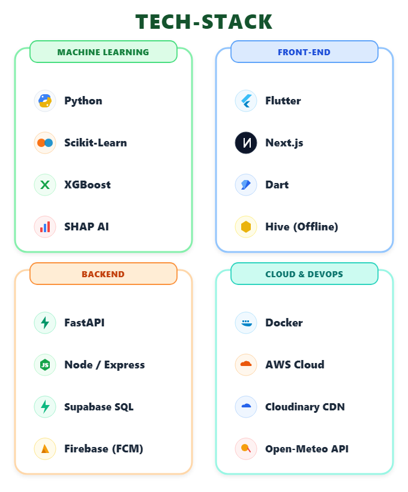
</div>

<br/>

| Tier | Technologies / Frameworks | Purpose & Scope |
| :--- | :--- | :--- |
| **Mobile Client** | **Flutter 3.x, Dart 3.x, GetX** | Cross-platform (Android, iOS, Web) field client with reactive state management and route bindings. |
| **Edge Storage** | **Hive Local DB, SharedPreferences** | Fast, indexed, encrypted NoSQL key-value boxes enabling full offline CRUD and mutation queues. |
| **Web Portal** | **Next.js 16, React 19, Tailwind CSS** | Server-side rendered administrative command portal with responsive desktop and tablet views. |
| **Web State & Charts**| **TanStack React Query, Zustand, Recharts** | Reactive server caching, centralized client stores, and interactive epidemiological analytics. |
| **Backend API** | **Node.js, Express, TypeScript, Zod** | RESTful API gateway handling business logic, payload validation, and database operations. |
| **ML Microservice** | **Python 3.10+, FastAPI, NumPy, Scikit-Learn** | Triage probability estimation and DBSCAN spatio-temporal outbreak cluster detection. |
| **Database & Auth** | **Supabase (PostgreSQL 15), PostgREST** | Relational data persistence, Row-Level Security (RLS), Google OAuth 2.0, and Realtime streams. |
| **Media & Assets** | **Cloudinary CDN** | Automatic compression, secure HTTPS storage, and public ID tracking for animal ear-tag photos. |
| **Meteorology** | **Open-Meteo REST API** | Keyless real-time weather, humidity, and temperature data for THI heat stress modeling. |
| **Deployment** | **Vercel, Render, Docker, GitHub Actions** | Global edge hosting for web portal, auto-deploying containerized backend, and APK builds. |

---

## 🚀 Getting Started & Local Setup

### Prerequisites
- **Flutter SDK**: `^3.10.4` or higher ([Install Guide](https://docs.flutter.dev/get-started/install))
- **Node.js**: `v18.0.0` or higher & `npm`
- **Python**: `3.10` or higher (for ML microservice)
- **Supabase Account**: Configured database with `schema.sql` applied

---

### 1. Mobile App Setup (`app/`)

```bash
# 1. Navigate to the mobile app directory
cd app

# 2. Install Flutter dependencies
flutter pub get

# 3. Verify design tokens and run all 60 automated tests
flutter test

# 4. Run on a connected Android device or Chrome emulator
flutter run
# Or specifically for web:
flutter run -d chrome
```

> **Google Maps Android Setup:**  
> Add your Google Maps API key in `app/android/app/src/main/res/values/secrets.xml`:
> ```xml
> <?xml version="1.0" encoding="utf-8"?>
> <resources>
>     <string name="google_maps_api_key">YOUR_GOOGLE_MAPS_API_KEY</string>
> </resources>
> ```

---

### 2. Web Portal Setup (`web/`)

```bash
# 1. Navigate to the web directory
cd web

# 2. Install dependencies
npm install

# 3. Configure local environment variables
cp .env.example .env.local

# 4. Start the Next.js development server
npm run dev
```

Visit `http://localhost:3000` in your browser.

---

### 3. Backend API Gateway Setup (`web/backend/`)

```bash
# 1. Navigate to the backend directory
cd web/backend

# 2. Install dependencies
npm install

# 3. Build and launch development server
npm run dev
```

The Express API will start on `http://localhost:10000` (or `PORT` specified in `.env`).

---

### 4. ML Microservice Setup (`web/ml_service/`)

```bash
# 1. Navigate to the ML service directory
cd web/ml_service

# 2. Create and activate a virtual environment
python -m venv venv
# On Windows:
.\venv\Scripts\activate
# On Linux/macOS:
source venv/bin/activate

# 3. Install requirements
pip install -r requirements.txt

# 4. Run FastAPI with Uvicorn
uvicorn main:app --reload --port 8000
```

Interactive API documentation available at `http://localhost:8000/docs`.

---

## 🧪 Testing & Quality Assurance

The codebase incorporates a comprehensive automated test suite spanning offline persistence, sync queues, conflict resolution, clinical triage logic, and geospatial calculations:

```bash
cd app
flutter test
```

### Test Suite Summary (60/60 Tests Passing)

| Test Module | Coverage Area | Status |
| :--- | :--- | :---: |
| `health_intelligence_test.dart` | Clinical Triage Rules, THI Heat Index Equations, Herd Health Ratios | ✅ PASS |
| `geospatial_risk_test.dart` | Coordinate Validation, Proximity Clustering, Incident Weighting | ✅ PASS |
| `qr_and_animal_workflow_test.dart` | QR URI Parsing, Cloudinary Public ID Extraction, Animal Models | ✅ PASS |
| `auth_flow_test.dart` | Deep Link Callbacks, Session Token Resolution, Role Mapping | ✅ PASS |
| `local_database_service_test.dart`| Hive CRUD Operations, Model Serialization, Reactive Streams | ✅ PASS |
| `sync_queue_and_mutation_test.dart`| Mutation Journaling, FIFO Ordering, Exponential Backoff, Poison-Pill Quarantine | ✅ PASS |
| `conflict_resolution_test.dart` | Timestamp Conflict Logic, Field-Level Merging, Last-Write-Wins | ✅ PASS |
| `offline_repository_workflow_test.dart`| End-to-End Offline Animal Registration, Offline Treatments, Cache Warmup | ✅ PASS |
| `widget_test.dart` | Design System Tokens, Typography, Theme Integrity | ✅ PASS |

---

## 🌐 Production Deployment

FarmShield is designed for turnkey continuous delivery:

### 1. Web Portal (Vercel)
- Live URL: [https://farm-shield-psi.vercel.app/](https://farm-shield-psi.vercel.app/)
- Root Directory in Vercel: `web`
- Framework Preset: `Next.js`

### 2. Backend API Service (Render)
- Live API URL: `https://farmshield-buvy.onrender.com`
- One-click blueprint available via [`render.yaml`](render.yaml)
- Build Command: `npm install && npm run build`
- Start Command: `npm start`

### 3. Android APK Release
- Downloadable standalone APK: [FarmShield.apk (v1.0)](https://github.com/kartikwritescode/FarmShield/releases/download/v1/FarmShield.apk)
- Built with Flutter release optimization, ProGuard minification, and deep linking scheme registration.

Detailed instructions are available in [DEPLOYMENT.md](DEPLOYMENT.md).

---

## 📄 License

This project is open-source software licensed under the **[MIT License](LICENSE)**.

```text
MIT License

Copyright (c) 2026 FarmShield

Permission is hereby granted, free of charge, to any person obtaining a copy
of this software and associated documentation files (the "Software"), to deal
in the Software without restriction, including without limitation the rights
to use, copy, modify, merge, publish, distribute, sublicense, and/or sell
copies of the Software, and to permit persons to whom the Software is
furnished to do so, subject to the following conditions:

The above copyright notice and this permission notice shall be included in all
copies or substantial portions of the Software.
```

---

<div align="center">
  <sub>🛡️ <b>FarmShield</b> • Protecting Livestock, Safeguarding Human Health, Ensuring Food Safety</sub>
</div>
